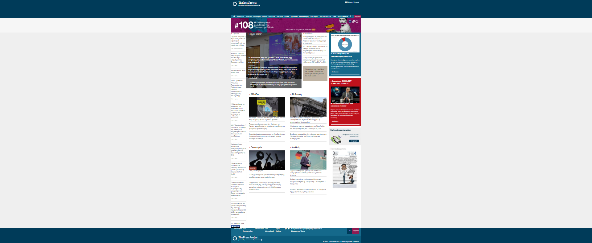

# 🌐 The press project

Welcome to my portfolio project!  
This website is a personal exercise and showcase to develop and demonstrate my front-end web development skills.

## ✨ **Project Overview**

This project is built entirely with:

- **HTML5**
- **CSS3** (with emphasis on **CSS Grid** and **Flexbox**) -**Bootstrap**
- **Responsive Design** techniques to ensure compatibility across different devices and screen sizes.

The structure and styling are inspired by professional news/magazine-style layouts, aiming to present content clearly and aesthetically.

## 🛠 **Purpose & Goals**

The main purpose of this project was to:

- Practice creating modern, flexible, and responsive layouts.
- Learn how to combine CSS Grid and Flexbox effectively.
- Build reusable components and organize CSS code in a maintainable way.
- Understand real-life design challenges, such as creating headers, footers, navigation menus, and content sections.

## 📱 **Features**

- Fully responsive layout: adapts smoothly to desktops and mobile screens.
- Navigation menu designed with Flexbox.
- Content sections arranged with CSS Grid.
- Custom components, such as news articles, cover photos, and support buttons.

## 🧰 **Technologies Used**

- HTML5
- CSS3 (Grid, Flexbox, media queries)
  -Bootstrap
- No frameworks or JavaScript – focusing purely on HTML and CSS.

## 🎯 **Project Highlights**

- Realistic header and navigation bar with logo and authentication links.
- Custom cover photo section with gradient overlay.
- Multi-column content layout using CSS Grid.
- Styled footer with site information, navigation options, and copyright.
- Attention to details: spacing, typography, hover effects, and color palette.

## ✅ **What I Learned**

- Combining Grid and Flexbox for complex layouts.
- Creating responsive designs using media queries.
- Managing visual hierarchy and consistency across the website.
- Better organization of CSS for scalability.

## 📌 **Next Steps**

In the future, I’d like to:

- Add JavaScript for interactive features.
- Include real article data fetched dynamically.
- Enhance accessibility

## Final Results

## 🙋‍♀️ **About Me**

I am a passionate learner and developer, building projects to explore and master front-end technologies.  
This portfolio website is part of my learning journey.

---

_Thank you for checking out my project!_
